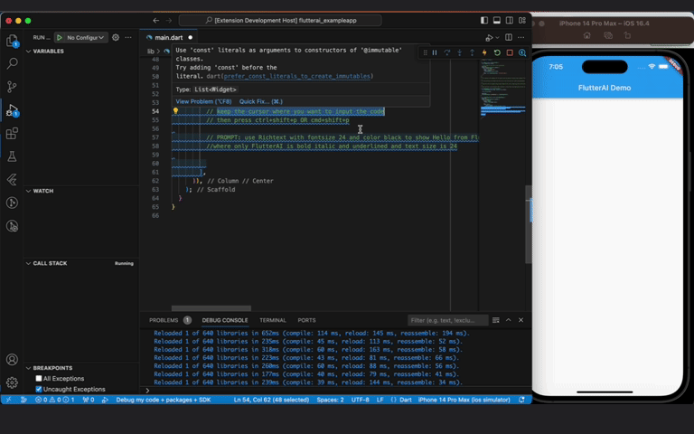

# flutterai README

FlutterAI is a VS Code extension that allows you to generate Dart code snippets based on natural language input. 

## Getting Started

1. **Generate API Key:**
   - Visit [Makersuite by Google](https://makersuite.google.com/) to obtain your free Gemini API key.

2. **Activate Extension:**
   - Press `Ctrl+Shift+P` (Windows/Linux) or `Cmd+Shift+P` (Mac) to open the command window.
   - Type in `FlutterAI: Generate Flutter Snippet` and press `Enter`.

3. **Enter API Key:**
   - When prompted, enter the API key you obtained in Step 1.

4. **Write Your Snippet Prompt:**
   - In the editor, write a natural language prompt for the Dart code you want to generate.
   - Wait for the code to be generated and automatically inserted at the current cursor position.

5. **Change Api key anytime:**
   - Type in the command window `FlutterAI: Enter/Replace Api key` and press `Enter`.
   - When prompted, enter the API key you want to change. That's it your Api key is changed.
   

## Features

**Generate Dart Code:** Quickly generate Dart code snippets based on natural language prompts.

> Tip: More descriptive your prompts better is the code output. 
Still it may not be accurate 100% all the time but it will improve with time.

## Requirements

 - Please update your VS Code to the latest version
 - Get your Api key to generate code snippets from https://makersuite.google.com/app/apikey

## Note
- This dart code generator is dependent on Gemini Pro as of now. 
- You can make 60 requests/min. according to Gemini documentation.
- Your Api key is stored locally in an encrypted form and is not exposed in anyway. 
- The code can be buggy so make sure to check the code.
- The code is generated by AI so all the conditions of using external Code are applied here as well.

## Extension Settings

No settings are required as of now just follow Getting started steps and you are good to go.

## Release Notes

Initial version with minimal Code generation feature.

### 1.0.0

Initial release of FlutterAI snippets generator.

---

## Contributions

We welcome contributions! If you find a bug, have a feature request, or want to contribute in any way, please check our Gitub Repo: https://github.com/yashpalzala/flutterai

## For more information

For support or inquiries, please contact me at yzala999@gmail.com.

Also you can connect with me at: https://www.linkedin.com/in/yashpal-zala/

**Enjoy!**
